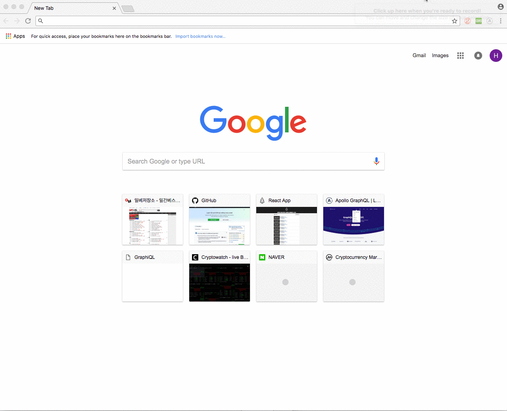

# eos block explorer

> Simple eos block explorer with server and client

### Before You Start...

This project is composed of express server to fetch block info from docker container running locally.
To try it out, you have to follow instructions from eos docker [README.md](https://github.com/EOSIO/eos/tree/master/Docker) to run eos blockchain in your local container.
Client will hit graphql gateway in express server to fetch block info.

## Getting started

1. Run docker image 
``` bash
$ docker run --name nodeos -p 8888:8888 -p 9876:9876 -t eosio/eos nodeosd.sh arg1 arg2
```

2. In both `apollo-server` and `client` folders, Run
``` bash
$ yarn install
$ yarn start
```

### Demo



